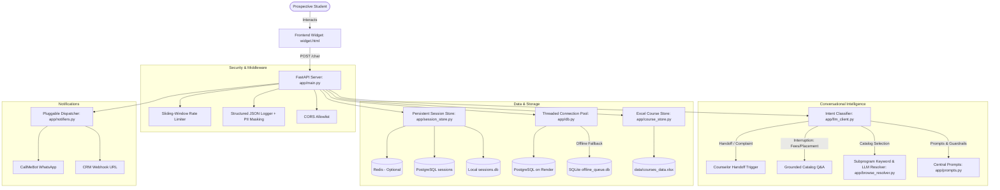

# 🎓 Cybrom Course Advisor Chatbot

A production-grade, conversational lead qualification and course recommendation assistant built for **Cybrom Ed-Tech Institute**. Powered by **FastAPI**, **Groq LLM (`openai/gpt-oss-120b`)**, **PostgreSQL** (with offline SQLite buffering), and an embeddable, accessible **Vanilla JS / CSS frontend widget**.

---

## 🏛️ System Architecture



---

## ✨ Key Features & Enhancements

1. **High Reliability & Zero-Downtime Boot**:
   - Connection pooling via `ThreadedConnectionPool` with automatic reconnect cooldown.
   - Startup initialization inside FastAPI lifespan handler — the server starts instantly even if PostgreSQL is sleeping or offline (operating in degraded mode).
   - Resilient offline queue: When PostgreSQL is down, leads and selections buffer into `data/offline_queue.db` and flush automatically in the background upon reconnection.

2. **Persistent Multi-Tier Session Store**:
   - Sessions survive worker restarts and multi-instance scaling.
   - Tiered hierarchy: **Redis** (if `REDIS_URL` is set) $\rightarrow$ **PostgreSQL** `sessions` table $\rightarrow$ **SQLite** persistent file (`data/sessions.db`) $\rightarrow$ In-memory fallback.
   - Configurable 24-hour TTL session expiry.

3. **Intelligent Conversational Routing**:
   - **Grounded Facts Only**: Strict prompt guardrails prevent inventing course fees, discounts, or placement guarantees.
   - **Roman-Script Hinglish**: Natural counselor persona (never Devanagari script).
   - **Interruption Resumption**: Students can ask questions mid-flow (e.g. *"fees kitni hai?"*, *"placement hota hai?"*); the bot answers accurately from catalog data and gracefully returns to the pending step without losing state.
   - **Subprogram Track Matching**: Keyword and LLM fallback mapping covering all catalog specializations (Gen AI, MLOps, IoT, Cyber Security, DevOps/Cloud, Data Analytics, Python, Java, MERN).
   - **Counselor Handoff**: Automatically detects escalation requests and queues immediate staff alerts.

4. **Frontend Conversion & UX (`widget.html`)**:
   - Visual progress stepper synchronized directly with backend `step` integer (1..4).
   - Automatic Render cold-start detection: displays *"Connecting to cloud server (waking up...)"* with timeout and in-chat retry button.
   - Responsive, accessible course cards with duration badges, key modules, and a prominent primary CTA button.

5. **Security, Compliance & Observability**:
   - In-memory sliding-window rate limiting per IP and per session.
   - Automated PII masking in logs (phone numbers and emails sanitized).
   - Protected `/admin/leads` and `/admin/stats` endpoints with constant-time authentication.
   - CSV export endpoint (`GET /admin/leads/export`).
   - Automated data-retention cleanup script (`scripts/cleanup_retention.py`).

---

## 📂 Project Directory Structure

```
course_chatbot/
├── app/
│   ├── __init__.py
│   ├── browse_resolver.py     # Subprogram matching & intent trigger rules
│   ├── config.py              # Centralized environment configuration
│   ├── course_store.py        # Excel course catalog loader
│   ├── db.py                  # PostgreSQL pooling, retries, and offline queue
│   ├── llm_client.py          # Groq LLM integration & intent classifier
│   ├── logging_config.py      # Structured JSON logging & PII masking
│   ├── main.py                # FastAPI endpoints & conversational router
│   ├── matching.py            # Course catalog filtering & card formatter
│   ├── notifiers.py           # Pluggable notification dispatcher
│   ├── prompts.py             # Central prompts & anti-injection guardrails
│   ├── schemas.py             # Pydantic request & response models
│   ├── security.py            # Rate limiting, PII masking & constant-time auth
│   ├── session_store.py       # Persistent session management (Redis/PG/SQLite)
│   ├── validators.py          # Phone, email, and name normalization
│   └── whatsapp_notify.py     # Notification caller bridge
├── data/
│   ├── courses_data.xlsx      # Active course catalog (31 courses)
│   ├── sessions.db            # Persistent local session store (gitignored)
│   └── offline_queue.db       # Local buffer for offline writes (gitignored)
├── scripts/
│   └── cleanup_retention.py   # Data retention & DPDP deletion script
├── tests/
│   ├── test_phase1_reliability.py
│   ├── test_phase2_smarter_conversation.py
│   ├── test_phase3_conversion_frontend.py
│   ├── test_phase4_security_compliance.py
│   ├── test_full_chat_flow.py # End-to-end integration test
│   └── eval_set.py            # 65-case evaluation benchmark
├── Dockerfile                 # Production Gunicorn/Uvicorn container
├── requirements.txt           # Pinned dependencies (UTF-8)
├── widget.html                # Embeddable frontend chat widget
├── load_test_chat.py          # Concurrency test reporting p50/p90/p95
├── PLAN.md                    # Phase execution plan
└── README.md                  # System documentation
```

---

## ⚙️ Environment Variables

Create a `.env` file based on `.env.example`:

| Variable | Description | Default |
| :--- | :--- | :--- |
| `GROQ_API_KEY` | Groq Cloud API key for conversational AI | *Required* |
| `GROQ_MODEL` | Groq LLM model name | `openai/gpt-oss-120b` |
| `DATABASE_URL` | PostgreSQL connection string | `postgresql://...` |
| `REDIS_URL` | Optional Redis URL for distributed sessions | *None* |
| `COURSES_FILE` | Path to Excel catalog | `data/courses_data.xlsx` |
| `COURSE_PAGE_BASE_URL` | Base URL for course links | `https://cybrom.com/courses` |
| `MAX_HISTORY_MESSAGES` | Sliding history window for LLM | `20` |
| `SESSION_EXPIRY_HOURS` | Session expiry time | `24` |
| `LEAD_CAPTURE_TIMING` | Capture timing: `early` or `after_value` | `early` |
| `CALLMEBOT_PHONE` | Admin WhatsApp phone for alerts | *None* |
| `CALLMEBOT_APIKEY` | CallMeBot WhatsApp API Key | *None* |
| `CRM_WEBHOOK_URL` | Optional CRM lead forward webhook | *None* |
| `ADMIN_USERNAME` | Basic Auth username for `/admin` | `admin` |
| `ADMIN_PASSWORD` | Basic Auth password for `/admin` | *Secure password* |
| `ALLOWED_ORIGINS` | Comma-separated CORS allowed domains | `*` |
| `RATE_LIMIT_PER_MINUTE` | Rate limit per IP/session | `60` |
| `DATA_RETENTION_DAYS` | Retention period in days for cleanup | `90` |
| `TEST_MODE` | Set `true` to disable outbound WhatsApp alerts | `false` |

---

## 🚀 Running Locally

### 1. Install Dependencies
```bash
python -m venv venv
# Windows
.\venv\Scripts\activate
# Linux/macOS
source venv/bin/activate

pip install -r requirements.txt
```

### 2. Run the Development Server
```bash
uvicorn app.main:app --reload --port 8000
```
Visit `http://localhost:8000/health` to verify server status.

### 3. Open the Chatbot Widget
Open `widget.html` in any modern web browser or embed it in an `<iframe>`.

---

## 🚢 Deploying to Render

### Option A: Standard Python Web Service
1. **Build Command**: `pip install -r requirements.txt`
2. **Start Command**: `gunicorn -w 2 -k uvicorn.workers.UvicornWorker -b 0.0.0.0:$PORT app.main:app`
3. Add Environment Variables in the Render Dashboard from your `.env`.

### Option B: Docker Container
1. Connect this GitHub repository to Render.
2. Select **Docker** environment. Render will automatically build using [Dockerfile](file:///c:/Users/HP/Desktop/Cybrom%20work/course_chatbot/Dockerfile) with multi-worker Gunicorn.

---

## 🧪 Testing & Evaluation

### Run Full Test Suite
```bash
pytest tests/ -v
```

### Run 65-Case Evaluation Benchmark
```bash
python tests/eval_set.py
```
*Current Benchmark Pass Rate: **100.0%** (Target: $\ge 90\%$).*

### Run Concurrency Load Test
```bash
python load_test_chat.py
```
Simulates 100 concurrent students and prints p50, p90, and p95 latency distributions.
